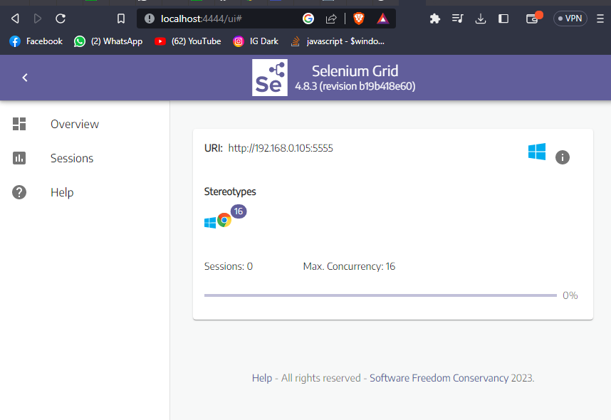

# Selenium Grid Server

## Cerinte:
1. Java (daca este instalat corect, ar trebui sa poti apela `java` din terminal) - https://www.java.com/download/ie_manual.jsp
2. Google Chrome 112.0.5615.X (sau orice versiune updatata)
3. ChromeDriver 112.0.5615.X (daca iti da eroare de incompatibilitate versiune, trebuie sa-l inlocuiesti cu versiunea corespunzatoare versiunii de Google Chrome: https://chromedriver.chromium.org/downloads)

## Pasi pornire:
1. Porneste `start.bat`
3. Acceseaza http://localhost:4444/ui

Daca totul a functionat corect, ai sa vezi:

## Important:
- Serverul de Selenium poate sa duca pana la un numar de sesiuni simultane egal cu numarul de thread-uri al procesorului
- Daca testul ti-a dat crash din motive de cod, procesul de `chromedriver.exe` nu s-a oprit, pentru a opri porneste scriptul `kill-chromedrivers.bat`
- Daca testul a rulat (chiar daca a picat la anumite conditii), `chromedriver.exe` se va opri